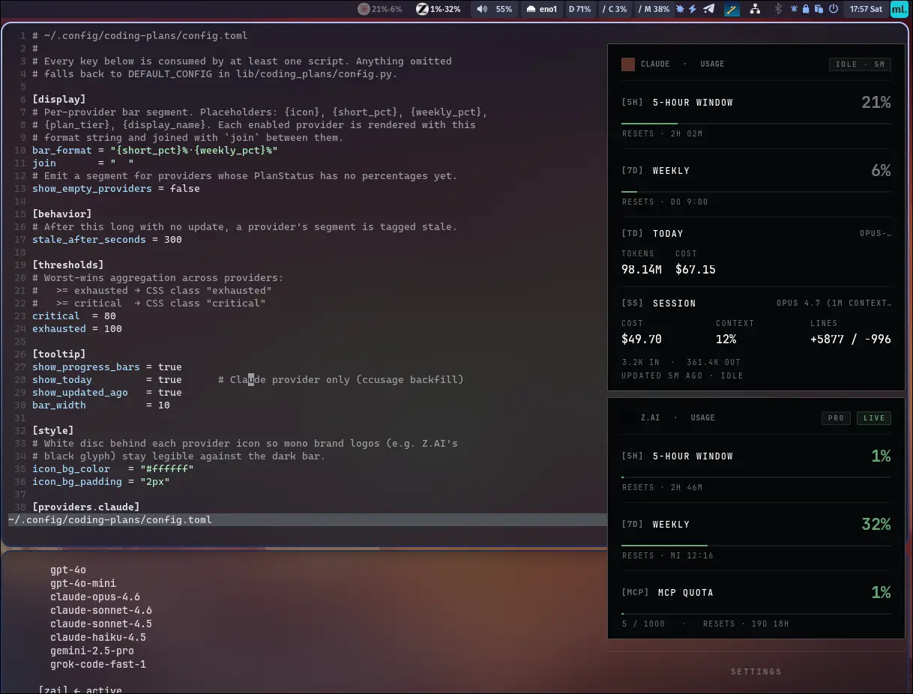

# coding-plans-waybar

A Waybar widget for AI coding-plan usage. One module per provider, each with its own brand icon via CSS `background-image`, stats (`5h%·weekly%`) as the label. Click any module → one unified Adwaita popover with per-provider cards.

Soft-forked from [infiniV/claude-usage-waybar](https://github.com/infiniV/claude-usage-waybar) (Claude-only) and extended with a pluggable provider system.



## v1 providers

- **Claude** (Anthropic) — via Claude Code statusLine + `ccusage`
- **Z.AI** (Zhipu GLM Coding Plan) — via `/api/monitor/usage/quota/limit`

Adding a third provider is two files. See [PROVIDERS.md](PROVIDERS.md).

## Install

```bash
git clone https://github.com/bennyzen/coding-plans-waybar
cd coding-plans-waybar
./install.sh
```

The installer:

1. Copies `coding-plans-{bar,popup,statusline,today}` to `~/.local/bin/`.
2. Copies the Python package + each provider's SVG + patcher helpers to `~/.local/share/coding-plans-waybar/`.
3. Seeds `~/.config/coding-plans/config.toml` with every provider enabled.
4. **Generates `custom/coding-plans-<id>` blocks into your Waybar config** — one per enabled provider — along with matching CSS that carries the SVG as a `background-image`. Everything is guarded by `// >>> coding-plans-waybar >>>` markers so a re-run replaces the block cleanly.
5. Registers a Claude Code `statusLine.command` (chaining any previous one).
6. Enables a 5-min systemd user timer for the `ccusage` backfill.
7. Reloads Waybar.

Custom Waybar config path? Set `WAYBAR_CONFIG=/path/to/config` (and optionally `WAYBAR_DIR=/path/to/dir` if `style.css` is co-located). The installer auto-probes `config`, `config.jsonc`, and `config.json`.

### Agent-ready config

Once installed, **the only file you edit is `~/.config/coding-plans/config.toml`**. Toggle providers on or off; re-run `./install.sh` to regenerate the Waybar module blocks. Minimal config:

```toml
[providers.claude]
enabled = true

[providers.zai]
enabled = true
# api_key_file = "~/.config/coding-plans/zai-key"   # default — chmod 600
```

### Z.AI API key

```bash
echo 'sk-…' > ~/.config/coding-plans/zai-key && chmod 600 ~/.config/coding-plans/zai-key
```

(The installer auto-migrates an existing `~/.config/claude-usage/zai-key` from upstream if you had one.)

### Coming from upstream `claude-usage-waybar`?

Run its `./uninstall.sh` first, then ours. We deliberately don't automate that migration.

## Styling

Every visual knob is a TOML key under `[style]` (global) or `[providers.<id>.style]` (per-provider override). Change a value, re-run `./install.sh`, done. Your overrides land in the generated CSS verbatim:

```toml
[style]
font_family      = ""             # "" = inherit from the bar
font_size        = "11px"
letter_spacing   = "0.02em"
padding          = "0 8px 0 23px" # room on the left for the icon
margin           = "0 3px"
icon_size        = "13px"
icon_position    = "6px center"
icon_bg_color    = ""             # e.g. "#ffffff" — disc behind the icon
icon_bg_padding  = "2px"          # ring width around the icon
border_radius    = ""             # e.g. "10px" for a pill shape
color            = "@foreground"  # uses the active Waybar theme's var

fresh_opacity    = 1.0            # dims the whole module (icon + disc + text)
stale_opacity    = 0.4
empty_opacity    = 0.28
critical_color   = "#c9a227"
exhausted_color  = "#d24646"
critical_weight  = "700"
exhausted_weight = "700"

# Per-provider override — bump Claude's icon a bit larger:
[providers.claude.style]
icon_size = "15px"

# Per-provider override — white disc behind just the Z.AI glyph:
[providers.zai.style]
icon_bg_color = "#ffffff"
```

## Layout

```
~/.local/bin/
├── coding-plans-bar          — Waybar exec (accepts --provider <id>)
├── coding-plans-popup        — GTK4 Adwaita popover
├── coding-plans-statusline   — Claude Code statusLine handler
└── coding-plans-today        — ccusage backfill (bash+jq)

~/.local/share/coding-plans-waybar/
├── lib/coding_plans/         — Python package
│   └── providers/
│       ├── <id>.py           — per-provider module (fetch + hooks)
│       └── icons/<id>.svg    — per-provider brand SVG
├── icons/                    — flat copy of provider SVGs (what CSS url() points at)
├── _generate_waybar.py       — reads config.toml, emits module + style blocks
├── _patch_waybar.py          — installs/uninstalls guarded Waybar block
├── _patch_style.py           — installs/uninstalls guarded style.css block
└── _patch_toml.py            — safe TOML edits for chained_command

~/.config/coding-plans/config.toml
~/.cache/coding-plans/state.json     — shared state, keyed by provider id
```

## Uninstall

```bash
./uninstall.sh
```

Reverses everything. Keeps `~/.config/coding-plans/` and your Z.AI key for a future re-install.

## Development / tests

```bash
python3 -m venv --system-site-packages .pytest_venv
.pytest_venv/bin/pip install pytest
.pytest_venv/bin/python -m pytest tests/ -q
```

28 tests: provider fetches, bar rendering, installer patcher roundtrip.

## Attribution

- Upstream: [infiniV/claude-usage-waybar](https://github.com/infiniV/claude-usage-waybar) — what was borrowed is catalogued in [UPSTREAM.md](UPSTREAM.md).
- Brand SVGs: [@lobehub/icons](https://lobehub.com/icons) (MIT).
